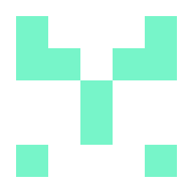

# Avatart
`v1.1.0`





This library run with the **native node APIs**, there is no dependency or api call so after the installation you can use this generator without internet too.

```bash
npm i avatart
```

```ts
import { AvatarGenerator } from "avatart";

const avatarGenerator = new AvatarGenerator();

// Write a png
avatarGenerator.writeAvatarFile("./outputs/output2a");

// Or get it as a buffer
const avatarBuffer:Buffer = avatarGenerator.getAvatarBuffer();
```
You can initialize the class with some default options or pass the same object type to every method that generates an avatar.
If you don't pass any arguments to the functions, the generations will be made on the class-initialization options.

Those are the options for every generative method and the constructor of the class:
```ts
export type AvatarGeneratorConstructor = {
    squareSize?:number,
    gridSize?:number,
    color?:RgbArray,
    backColor?:RgbArray,
    symmetry?:Symmetry,
    fixedSize?:number
}
```
* If no color is provided, there will be a random color every generation with a white background.
* If no symmetry is provided, there will be a random symmetry between horizontal or vertical.
* If `fixedSize` is provided, this will override the `squareSize` option as it will be automatically calculated.


Default values are:
* `squareSize: 40`
* `gridSize: 5`

The export is a class extending another one. Here are the interfaces.
```ts
export interface IAvatarGenerator extends IGridGenerator {
    readonly pngSignature:Buffer;
    readonly squareSize:number;
    readonly padding:number;
    readonly color:RgbArray | undefined;
    readonly backColor:RgbArray | undefined;

    writeGridAvatarFile: (grid:Grid, fileTitle:string, options?:AvatarGeneratorConstructor) => void;
    writeAvatarFile: (fileTitle:string, options?:AvatarGeneratorConstructor) => void;
    getGridAvatarBuffer: (grid:Grid, options?:AvatarGeneratorConstructor) => Buffer;
    getAvatarBuffer: (options?:AvatarGeneratorConstructor) => Buffer;
    getRandomColor: () => RgbArray;
}

export interface IGridGenerator {
    readonly symmetryOptions:Symmetry[];
    createGrid: (gridSize:number, symmetry?:Symmetry) => Grid;
}
```


Have fun.
